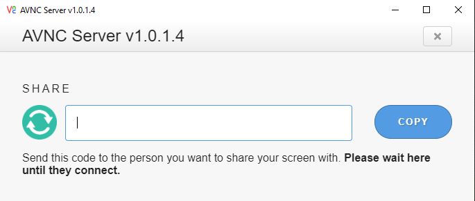

# Source code for AVNC Server

## What is VNC?
In computing, Virtual Network Computing (VNC) is a graphical desktop-sharing system that uses the Remote Frame Buffer protocol (RFB) to remotely control another computer. It transmits the keyboard and mouse events from one computer to another, relaying the graphical-screen updates back in the other direction, over a network.

## About AVNC Server
AVNC is Virtual Network Computing developed by electronjs and webrtc.

AVNC server is the program on the machine that shares some screen (and may not be related to a physical display – the server can be "headless"), and allows the client to share control of it.

